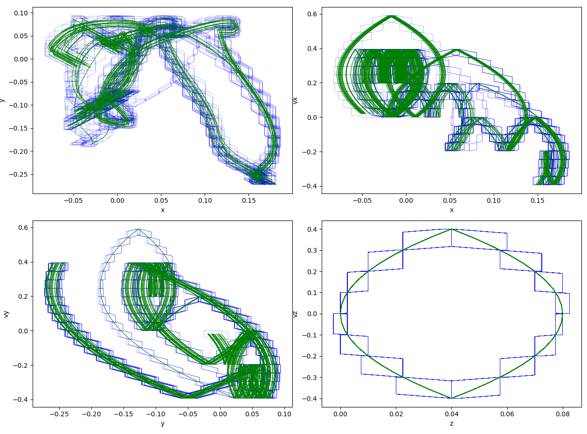

# Quadrotor example
This is the Quadrotor example that also used in [Verisig](https://https://github.com/Verisig/verisig/tree/master/examples/quadrotor/).

## Experiment results:
We verify the quadrotor controller for 30 control steps.

### Simulation result
We compare our result with several simulated trajectories

### Baseline
We compare our results with the Verisig result. Verisig verification takes 1385 seconds.

### Polar with symbolic remainder

#### Flowstar stepsize = 0.01
Polar Verification takes 186 seconds.

#### Flowstar stepsize = 0.02
Polar Verification takes 108 seconds.

#### Flowstar stepsize = 0.05
Polar Verification takes 63 seconds.

#### Flowstar stepsize = 0.1
Polar Verification takes 57 seconds.

### Polar without symbolic remainder

#### Flowstar stepsize = 0.01
Polar Verification takes 182 seconds.

#### Flowstar stepsize = 0.02
Polar Verification takes 110 seconds.

#### Flowstar stepsize = 0.05
Polar Verification takes 63 seconds.

#### Flowstar stepsize = 0.1
Polar Verification takes 56 seconds.

